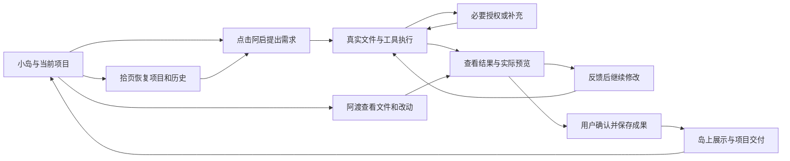

# 创作岛最终画面与使用体验

本方案描述开放式 AI 项目创作的目标体验。0.2.0 主流程已实现并通过本机验收，但下文目标不代表每项细节均已完成，实际状态见 [开发进度](progress.md)。能力与交付边界以 [产品终态](product-spec.md) 为准；真实起点、项目记录、截图标注及成果封面的后续细化见 [四项增强方案](next-iteration-plan.md)。三维画面复用现有地图的空间与交互基础，按 [品牌与角色设计](brand-and-characters.md) 更新人物、标牌、道具与语气，不要求重新建造整套世界。

## 打开产品

画面是一个可以互动的岛屿。造物台上的阿启是最明确的创作入口，拾页、阿渡和灵感夹具有轻量功能标签。展示区能看见自己确认过的成果。地图主视区没有覆盖大半屏幕的宣传卡片。

左上角是当前项目名称，旁边可展开项目簿。右上角只有通知、帮助、设置。下方可以保留小型快捷入口：找阿启、项目与历史、文件、成果。点击快捷入口与点击对应岛上对象产生相同结果。

第一次进入只给一条引导：“有个想法？和阿启说说，或者先玩一个例子。”用户可以立即提出自己的需求，不需要学习 WASD，不需要先选择问答、贺卡或故事。熟悉游戏操作的用户仍可走动和探索。

再次打开时显示具体的继续提示，例如“读书记录工具：上次在调整收藏按钮”，附继续入口。有中断任务则写明中断，有未处理授权则显示待处理，不能一律欢迎用户创建新项目。

## 在阿启面前开始创作

点击阿启，镜头轻微靠近中央平台。右侧出现对话区域，岛屿及阿启留在左侧。第一次交谈不播放长介绍。默认面板在普通桌面宽度约占三分之一至五分之二，具体尺寸以可读性和实际布局验收为准。

对话上方能看见项目和当前工作，下方是自然语言输入、参考文件和发送按钮。模型与权限信息可查，复杂配置收在次要入口。用户输入：“给社团做一个活动页面，能看日程、筛选活动，风格活泼一点。”

阿启先分清是否需要真实报名与后台服务。用户只需要展示和本地筛选时，就简短复述这些条件并开始；若要收集他人的报名数据，明确需要存储、服务和部署条件。不能默默做一个只会弹提示的报名按钮，然后声称真实报名功能已经完成。

新项目只需要确认名称、位置和简短制作目标。可以在默认位置开始，也可以选择已有文件夹。已经选中的项目保持不变，不反复问用户存放在哪里。

## 执行时的小岛

阿启的屏幕和动作反映真实执行状态：正在工作、等你确认、需要补充、已结束或遇到问题。用户打开详细过程可看到读取文件、修改文件、运行命令和实际结果。

用户收起对话，阿启继续工作。可以探索岛屿、翻手册或查看已有文件。全局一轮写入任务的约束在界面中明确；其他项目不会因点击而悄悄启动第二轮执行。

需要授权时，阿启的标记持续存在，通知说明具体操作。普通结束使用短提示，用户正在看其他内容时不自动移动镜头，不弹出强制剧情。提示消失后仍能从通知或阿启找回结果。

原版固定搬运表演退出主流程，改用阿启的工作灯和短动作表达状态。减少动态偏好下以直接状态变化代替演出。

## 打开实际结果

当应用确认了预览地址和对应进程，阿启提供“看看作品”。结果区域在创作台上下文内展开，成为本轮的主视觉。预览上方写明项目和运行状态，下方保留“继续修改”“查看改动”“保存成果”。

桌面上，预览约占主要区域，旁边保留精简对话或修改输入，岛屿仍有可辨识的一部分。用户选择放大后可以全屏工作；收起后回到同一个阿启、同一个项目和上次位置。系统不坚持为了露出地图而把作品缩到无法使用。

作品是实际运行的网页。用户可以输入、点击、切换页面和观察结果。若服务未启动，显示“准备预览”；启动失败则显示失败原因和“让阿启修复”。找不到运行方式时允许看源码和说明，不提供假预览。

当前编辑内容和已保存成果要有清楚标签。修改期间可以保留上一个可用预览，同时说明它还没更新；不能让旧预览冒充刚完成的新结果。

## 从反馈进入下一轮

用户试玩后说：“保留内容，把首页做得更像一本杂志。”阿启在当前项目与会话中继续修改。用户也可以给出截图、页面名称或文件，缩小修改范围。

此处没有固定的“问题 1、段落 2”目录，也不要求填写结构化表单。针对任意网页，优先保证对话、参考、文件和真实改动的闭环。

结果检查提供两层信息：先用自然语言说明改了哪些功能和页面，再按需展示实际文件差异。不能把模型摘要当作文件事实。用户可以继续修正，也能在明确范围后保存当前成果。

## 拾页和阿渡

拾页打开项目簿，包含最近项目、查找历史、继续会话和打开已有项目。选择已有项目后恢复它的小岛档案，项目名称、阿启的会话、文件和展示区一起变化。项目切换不播放长转场，不自动发送消息。

阿渡打开文件与交付面板。默认先回答“这一轮做了什么”：新增、修改、删除了哪些文件；再允许进入目录、预览内容和查看完整差异。导出前显示将交付哪个成果、包含什么、需要哪些运行条件。

两位角色的功能无需消耗模型；只有明确让阿启解释或修改时才调用模型。他们提供稳定的管理入口，不表演三位 AI 正在分工协作。

## 保存成果与展台

用户实际体验并确认满意后，选择“保存成果”，例如命名为“活动页面第一版”。保存成功才出现成果卡：真实截图、名称、日期、运行说明。选择空展位后，岛上对应展品发生变化。

展品点击后先说明它是哪份项目、哪个成果版本。可以查看、准备该版本的试玩、导出，或从它继续创作。继续创作不会悄悄改掉旧成果快照。

六个位置是一组精选成果，不是存储容量。满了以后明确选择替换展示对象，原成果留在项目簿中。用户可以调整固定位置的陈列顺序，但没有自由建岛和装饰编辑器。

所有成果演出可以跳过。重启恢复已有展品时不重复庆祝。失败保存、回复结束和服务启动都不能生成一个成功展品。

## 交付给别人

活动页面具备静态构建时，用户可导出静态目录与使用说明；需要后台时则导出源码、配置示例和启动说明，清楚说明依赖。真正自包含的单文件结果才显示“离线 HTML”。

收到文件的人不需要安装创作岛才能阅读源码或按说明运行，但可能需要项目本身的环境。首版不承诺一键公网链接，也不把本机地址标成别人可以访问的分享链接。

## 四种屏幕状态

| 状态 | 世界承担的作用 | 屏幕主要内容 | 离开后保留什么 |
| --- | --- | --- | --- |
| 岛屿总览 | 项目导航、任务状态、成果陈列 | 三维世界、必要标签与少量固定入口 | 当前项目、相机位置 |
| 角色交谈 | 标明正在与谁做什么 | 岛内对话或管理面板，世界仍可辨认 | 会话、输入草稿、未处理状态 |
| 结果体验 | 给当前任务提供连续上下文 | 可运行预览、修改输入、文件差异入口 | 任务、预览归属及可恢复上下文 |
| 专注模式 | 通过明确返回入口保留归属 | 大面积对话、预览或文件内容 | 返回同一项目与岛上位置 |

窄窗口允许角色面板全屏，用清晰的“返回小岛”恢复上下文。无障碍和轻量模式以角色列表与相同项目状态承接，不能因无法渲染 3D 而无法工作。

## 一条连续的产品路径

## 与现有版本的差别

| 维度 | 现有三类作品版 | 新目标 |
| --- | --- | --- |
| 创作对象 | 结构化问答、贺卡、故事数据 | 真实项目目录、源码与资源 |
| AI 作用 | 生成或修改受限内容结构 | 按授权读取、实现、运行、检查与迭代项目 |
| 用户入口 | 首页与独立创作室 | 岛上角色和对象，专注模式按需展开 |
| 修改检查 | 固定字段前后差异、采用候选 | 真实文件改动、运行结果与用户反馈 |
| 成功标志 | 保存作品版本 | 用户确认并保存明确的项目成果节点 |
| 输出 | HTML 和 isle.json | 项目包、适用的静态构建包或单文件作品 |

与原始 QCode 相比，本方向保留其角色化项目入口，重点补齐明确的预览状态、成果节点、历史成果归属与交付清单。恢复原界面只是基础，不等同于这些新体验已经完成。
